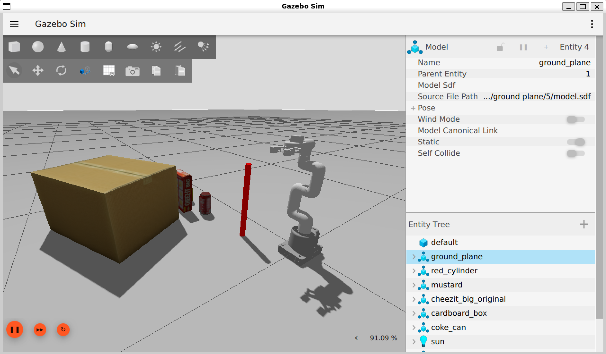

# mycobot_ros2

A personal practice repository for learning and experimenting with **ROS2** and **Gazebo**.



## Tech Stack

| Component | Version |
|---|---|
| **OS** | Ubuntu 24.04 (WSL2 supported) |
| **ROS 2** | Jazzy Jalisco |
| **Simulator** | Gazebo Harmonic (gz-sim) |
| **Languages** | C++ 17, Python 3 |
| **Robot** | myCobot (Elephant Robotics) |

## Getting Started

```bash
cd ros2_ws/src

# Clone the repo
git clone https://github.com/Prajwal-Mohapatra/mycobot_ros2.git
cd mycobot_ros2

# Build
colcon build

# Source the workspace
source install/setup.bash
```
## Robot

The practice robot used here is the **myCobot** a small, 6-DOF collaborative robot arm by Elephant Robotics.

## Project Structure

```text
mycobot_ros2/
├── mycobot_bringup/        # Launch files for real and simulated robot bringup
├── mycobot_description/    # Robot description files (URDF/Xacro, meshes, RViz configs)
├── mycobot_gazebo/         # Gazebo simulation assets (worlds, models, plugin configs)
├── mycobot_moveit_config/  # MoveIt 2 configurations for motion planning and kinematics
├── mycobot_ros2/           # Core utilities and metapackage definitions
├── mycobot_system_tests/   # System-level test scripts and custom controllers
└── media/                  # Documentation assets and images
```

## Purpose

This repo is not intended for production use. It exists solely to:

- Build hands-on familiarity with ROS2 concepts (nodes, topics, services, actions, etc.)
- Explore robot simulation using Gazebo
- Experiment with URDF/Xacro robot descriptions
- Practice ROS2 package structure and tooling (colcon, rviz2, etc.)

## Credits

Inspired by and based on the excellent work of **Automatic Addison**:

- 🔗 [automaticaddison/mycobot_ros2](https://github.com/automaticaddison/mycobot_ros2)

All credit for the original implementation, tutorials, and design goes to them. This repository is purely a personal learning exercise built on top of their foundation.

## License

For learning purposes only. Refer to the [original repository](https://github.com/automaticaddison/mycobot_ros2) for licensing information.
